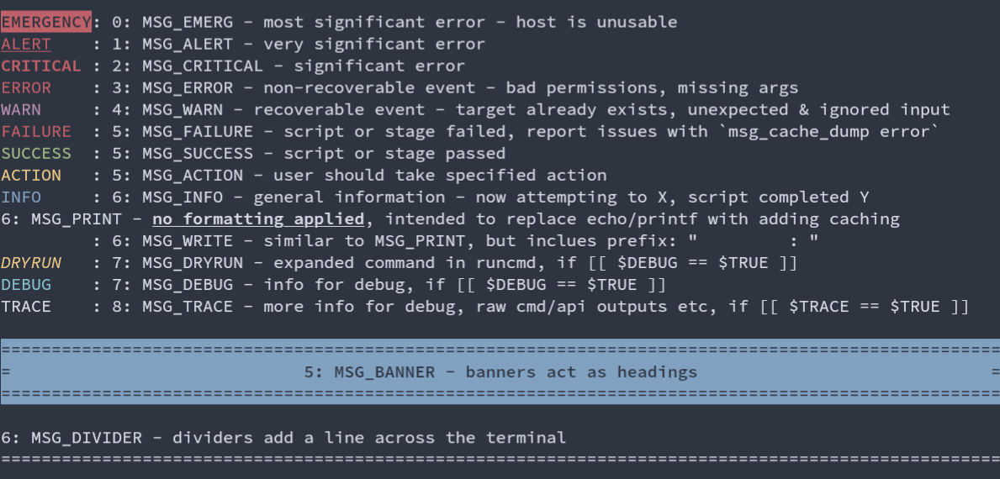
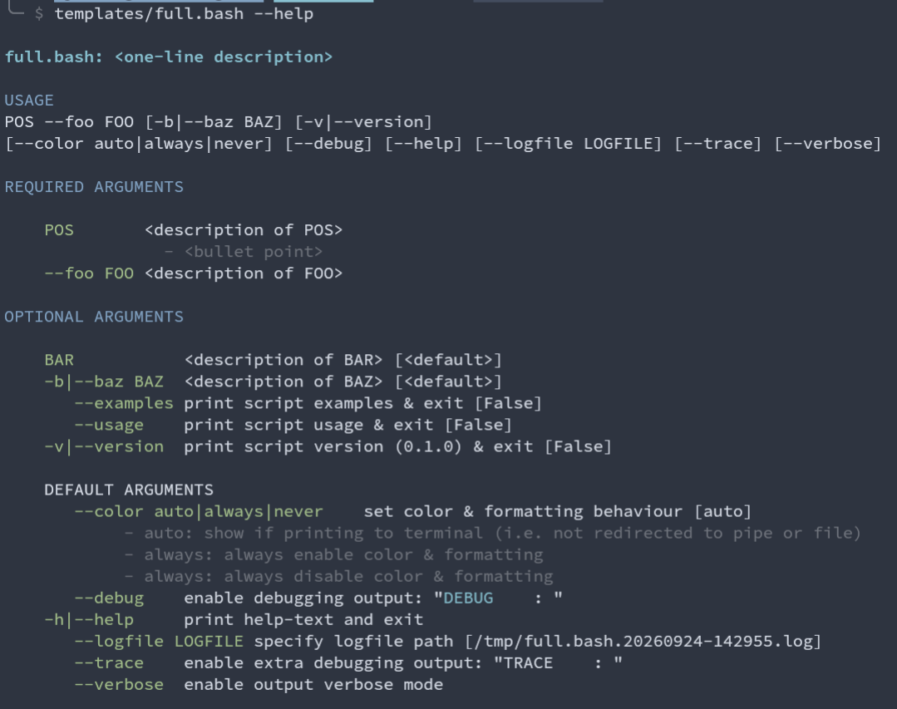

# bash-lib

`bash-lib` provides an all-in-one Bash Library which can be used to...

- create scripts for production or one-off applications
- add to your ~/.bashrc

## Features

- formatted messaging library
  - deb
- templates for lightweight & production Bash scripts
- interactive demo script
- common utilities
  - argument parsing
    - `-ab --color=never`
  - logging which can be toggled
    - e.g. avoid password prompts, API keys in logfiles
  - runcmd() with dryrun, debug & trace support
  - if\_\* functions to easily check if...
    - debug/trace/verbose/dryrun are enabled
    - specified file descriptor exists
  - robustly query terminal size, falling back to standard 80x24 when no pseudo-terminal is present
  - ...

## Status

> [!CAUTION]
> This is work-in-progress library, approaching a 1.0 release.
> Use at your own risk

## Screenshots

Demo of msg\_\*() functions to pretty-print messages

Demo of manually-formatted help-text using formatting.sh

## Usage

1. grab project files
   - `git clone https://github.com/guyg-codes/bash-lib.git`
1. set BASH_LIB & call demo script
   - `BASH_LIB="${PWD/bash-lib} ./bash-lib/scripts/formatting.demo.sh`
